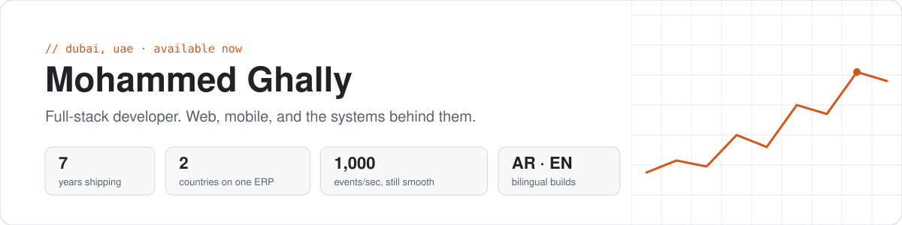
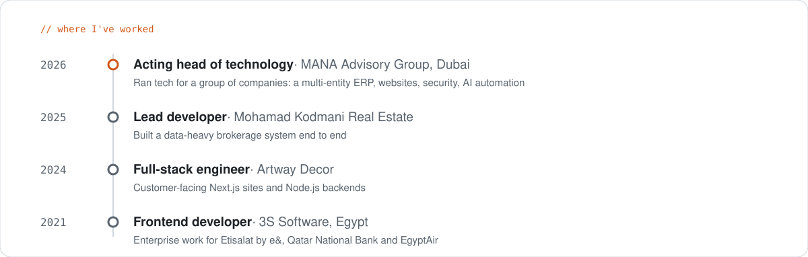

<picture>
  <source media="(prefers-color-scheme: dark)" srcset="assets/header-dark.svg">
  
</picture>

I build web and mobile products with React, Next.js, TypeScript and Node.js, and lately I've also been the person a group of companies calls when anything technical needs deciding. Most of that work is private, so here's the short version.

### Things you can open right now

| | What it is | Built with |
|---|---|---|
| [**Live monitoring dashboard**](https://live-dashboard-lilac.vercel.app/) | Real-time events at 1,000 a second without the UI choking. Every frame is treated as untrusted and rebuilt before it's shown. [Code](https://github.com/mghally999/live-dashboard) | React 19, TypeScript, virtualised lists, Vitest |
| [**Park & Launch**](https://github.com/mghally999/park-and-launch) | Marine services app: boat parking, deliveries and charters, with live GPS tracking | React Native, Node.js, MongoDB, Socket.io |
| [**Montaigne Design**](https://www.montaignedesignmena.com/en) | Company site for an interior design firm, live in production | Next.js |
| [**Build-Tech**](https://build-tech.ae) | Company site for a coatings contractor, live in production | Website and hosting |
| [**Sofia Contracting**](https://sofiacontracting.com) | Company site for a Dubai contractor, live in production | Website and hosting |
| [**Suofeiya MENA**](https://suofeiyamena.com) | Regional site for a furniture and interiors brand | Next.js |

The thing I'm proudest of isn't linkable: an ERP that finance and operations teams in Dubai and Belgium use every day, with approval flows and access rules that keep each company's numbers separate.

<picture>
  <source media="(prefers-color-scheme: dark)" srcset="assets/timeline-dark.svg">
  
</picture>

### How I work

I write down what "done" looks like before I start, including the boring states: loading, empty, error, slow network. I use AI coding tools every day and read their output like a pull request from someone new. And I like being close to the people who actually use the thing.

[mohammedghallydev@gmail.com](mailto:mohammedghallydev@gmail.com) · [LinkedIn](https://www.linkedin.com/in/mghally999/) · open to full-time roles in the UAE
